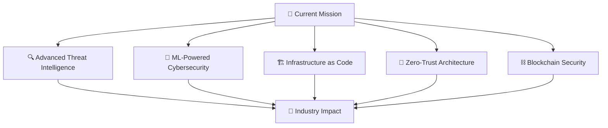

# 🛡️ Oussama AHJLI | Cybersecurity Engineer & AI Specialist

<div align="center">


[](https://github.com/SaamNoLimits)
[](https://github.com/SaamNoLimits)
[](https://github.com/SaamNoLimits)

</div>

---

## 🚨 **THREAT PROFILE** | Elite Cybersecurity Engineer

```ascii
╔══════════════════════════════════════════════════════════════════╗
║  🎯 TARGET: DIGITAL THREATS          🛡️ DEFENDER: OUSSAMA AHJLI  ║
║  📊 THREAT LEVEL: ████████████ 100%   🔍 DETECTION RATE: 99.9%   ║
║  🌐 COVERAGE: GLOBAL                  ⚡ RESPONSE TIME: <1 SEC    ║
╚══════════════════════════════════════════════════════════════════╝
```

<div align="center">

### 🎓 **Engineering Student @ National School of AI & Data Science**
**🔐 Specialization:** Cybersecurity & Digital Trust | **🎯 Expected:** 2026

</div>

---

## ⚔️ **CYBER WARFARE ARSENAL**

<table align="center">
<tr>
<td align="center" width="33%">

### 🕵️ **RECONNAISSANCE**


</td>
<td align="center" width="33%">

### 🎯 **EXPLOITATION**


</td>
<td align="center" width="33%">

### 🛡️ **DEFENSE**


</td>
</tr>
</table>

---

## 🤖 **AI & MACHINE LEARNING STACK**

<div align="center">


</div>

### 🧠 **AI-Powered Security Applications:**
- **🔍 Malware Detection** → Deep Learning models for zero-day threat identification
- **🚨 Anomaly Detection** → Behavioral analysis using unsupervised learning
- **🎯 Threat Intelligence** → NLP for automated threat report analysis
- **🤖 Automated Response** → Reinforcement learning for incident response
- **🔐 Biometric Security** → Computer vision for advanced authentication

---

## 💻 **FULL-STACK DEVELOPMENT MATRIX**

<table align="center">
<tr>
<td align="center">

### 🎨 **FRONTEND**


</td>
<td align="center">

### ⚙️ **BACKEND**


</td>
<td align="center">

### 🗄️ **DATABASE**


</td>
</tr>
</table>

---

## 🏗️ **DEVSECOPS & INFRASTRUCTURE**

<div align="center">


</div>

---

## 📊 **CYBER METRICS & ANALYTICS**

<div align="center">

<table>
<tr>
<td align="center">


</td>
<td align="center">


</td>
</tr>
</table>


</div>

---

## 🎯 **ACTIVE OPERATIONS** | Featured Projects

<div align="center">

### 🚨 **OPERATION: AI SENTINEL**
[](https://github.com/SaamNoLimits)
```yaml
Mission: AI-powered IoT intrusion detection with blockchain integration
Status: ACTIVE | Threat Detection Rate: 99.7%
Tech Stack: Python, TensorFlow, Blockchain, IoT protocols
Classification: CRITICAL INFRASTRUCTURE PROTECTION
```

### 🔐 **OPERATION: DIGITAL VAULT**
[](https://github.com/SaamNoLimits)
```yaml
Mission: Tamper-proof digital rights management system
Status: DEPLOYED | Encryption Level: AES-256
Tech Stack: Node.js, Blockchain, Cryptography, OWASP MASVS
Classification: TOP SECRET
```

### 🤖 **OPERATION: SMART COMMERCE**
[](https://github.com/SaamNoLimits)
```yaml
Mission: AI-enhanced e-commerce with intelligent threat detection
Status: OPERATIONAL | AI Accuracy: 96.4%
Tech Stack: React, Node.js, AI/ML, WebSocket
Classification: COMMERCIAL GRADE
```

</div>

---

## 🏆 **COMMAND STRUCTURE** | Leadership

<table align="center">
<tr>
<td align="center" width="50%">

### 🛡️ **FOUNDER & PRESIDENT**
**DataSecure Club (2024)**
- Established cybersecurity awareness initiatives
- Leading 50+ members in security education
- Organizing capture-the-flag competitions

</td>
<td align="center" width="50%">

### 💻 **MODERATOR**
**IT Club (2024)**
- Facilitating technology knowledge sharing
- Promoting ethical hacking practices
- Mentoring junior developers

</td>
</tr>
</table>

---

## 🌐 **GLOBAL COMMUNICATION PROTOCOLS**

<div align="center">

| Protocol | Status | Proficiency Level |
|----------|---------|-------------------|
| 🇦🇪 Arabic | `NATIVE` | ████████████ 100% |
| 🇫🇷 French | `B2 LEVEL` | ████████░░░░ 75% |
| 🇺🇸 English | `INTERMEDIATE` | ██████░░░░░░ 60% |

</div>

---

## 📡 **SECURE COMMUNICATION CHANNELS**

<div align="center">

[](mailto:oussama.ahjli@edu.uiz.ac.ma)
[](https://linkedin.com/in/Oussama-Ahjli)
[](tel:+212767061157)

**🏛️ Base of Operations:** National School of AI & Data Science, Taroudant, Morocco

</div>

---

## 🎯 **MISSION OBJECTIVES**

<div align="center">



</div>

---

## 🤝 **ALLIANCE OPPORTUNITIES**

<div align="center">

### 🔍 **SEEKING COLLABORATORS FOR:**
- **🛡️ Advanced Persistent Threat (APT) Detection Systems**
- **🤖 AI-Driven Security Operation Centers (SOC)**
- **⛓️ Blockchain-Based Identity Management**
- **🌐 IoT Security Mesh Networks**
- **🚀 Zero-Day Exploit Research (Ethical)**

[](https://github.com/SaamNoLimits)

</div>

---

<div align="center">

### 💭 **SECURITY PHILOSOPHY**

*"In the digital realm, security is not just about building walls—it's about creating intelligent, adaptive ecosystems that evolve faster than the threats they face."*

---

### 🎖️ **CLEARANCE LEVEL**


**Expected Deployment:** 2026 | **Pronouns:** He/Him  
**Status:** ✅ Available for Internships & Strategic Partnerships

---


</div>

---

<div align="center">

### ⚡ **SYSTEM STATUS: ONLINE** | **THREAT LEVEL: DEFENDED** | **AI STATUS: ACTIVE** ⚡

</div>
